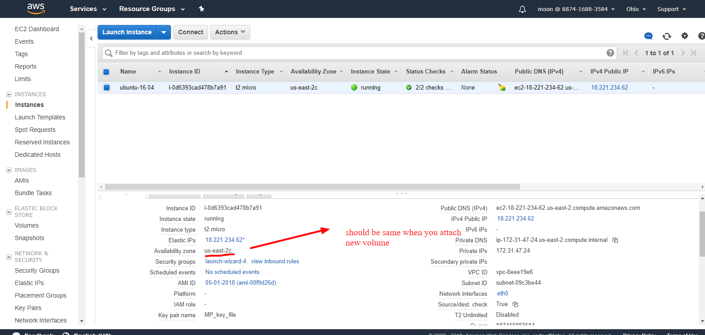
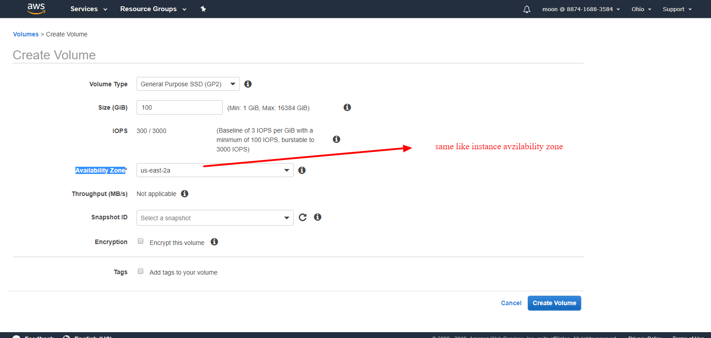

1) >https://us-east-2.console.aws.amazon.com/ec2/v2/home?region=us-east-2#Instances:sort=instanceId
	- stop instance - note down your instance id
2) >https://us-east-2.console.aws.amazon.com/ec2/v2/home?region=us-east-2#Volumes:sort=size
   Click on volume and create snapshot of current in use volume for the same instance 
3) >Create new volume with same Availability Zone   
	EC-2 Availability zone, you can verify same like below image
	
	
	Now click on create new volume
	Create new volume Availability zone, you can verify same like below image
	
	
4)  >Add size of you volume, suppose your existing volume size is 8 GB and you want to add more 16 GB
	then add Size (Gib) = 24 GB 

5) >Now detach your old volume
6) >Attach your new volume with instance
7) >Start instance
	if it's return error then copy of path which not found during start instance and attach new Volume again with  new [Like:- /dev/sda1] insatnce path
8) >start instance
9) Check size increase or not
	```df -h
	```	

URL:- https://knackforge.com/blog/karalmax/expanding-storage-space-ebs-volume-linux	